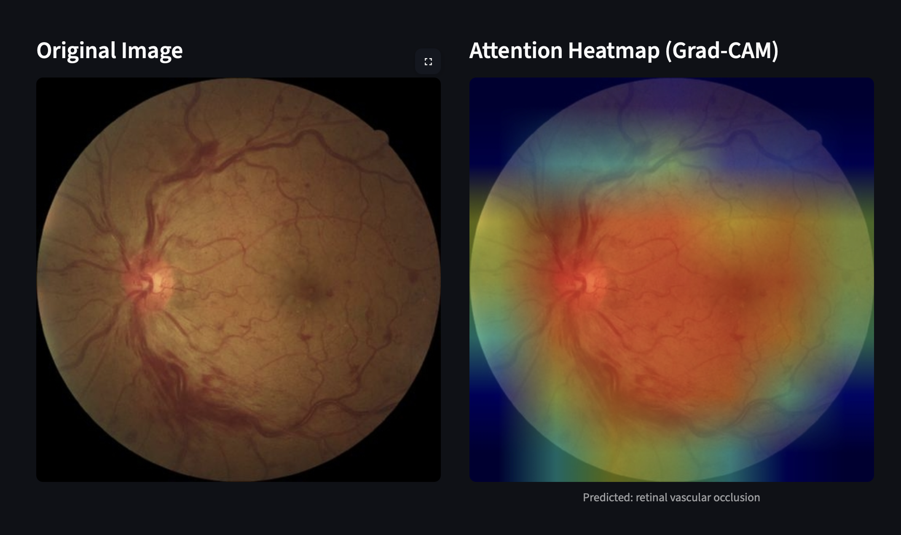
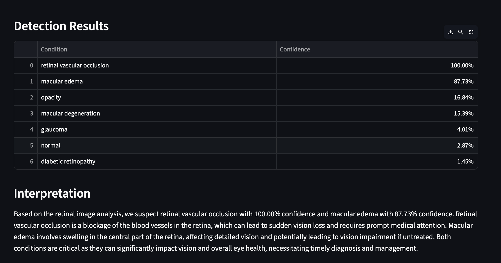

## Retinal Anomaly Detection
 
**Explainable A.I model for Retinal Disease Detection using Deep Learning**

---

## Problem Statement
Early diagnosis of retinal diseases—such as **diabetic retinopathy**, **glaucoma**, and **macular degeneration**—is vital to prevent irreversible vision loss. Traditional manual diagnosis:
- Is time-consuming  
- Requires skilled ophthalmologists and if not diagnosed early cand correctly, could lead to irreversible vision loss.
- Can suffer from inter-observer variability
  
This project builds an **automated and explainable AI system** to assist healthcare professionals in detecting retinal anomalies accurately and interpretably.

---

## My Objective
To build an end-to-end AI pipeline that:
- Detects multiple retinal diseases from fundus images  
- Explains its predictions in **plain English**
- Uses a Grad-Cam (heapmap) to add depth to its prediction

The aim is to make diagnosis faster, more transparent, and educational—for both patients and practitioners.

---

## Targeted Diseases
As of now, the diseases covered by the model are:
- Opacity
- Diabetic Retinopathy
- Glaucoma
- Macular Edema
- Macular Degeneration
- Retinal Vascular Occlusion
- Normal Eye

---

## Project Overview
**Website**: https://blueraymusic.github.io/Retinal/

### 1. Multi-Label Retinal Disease Classifier
- **Model**: Transferring learning from  `ResNet50` (changed the 4th layer to train on the data, so as to keep the other trained features)
- **Dataset**: Fundus images from Kaggle + other public sources  
- **Labels**: Multi-label output for 7 retinal conditions 


### 2. Inference & Upload Interface
- Upload a retinal image via a CLI or web interface  
- The model:
  - Verifies image validity  
  - Preprocesses and predicts diseases (With Percentages)
  - Displays top diseases with confidence scores  
  - Explains the results in plain english covering how and what the eye is subject to

### 3. Explainability
- Converts technical predictions into human-readable summaries  

---

## OpenAI Integration
- GPT-4 receives:
  - Predicted diseases and confidence scores  
- GPT-4 responds with:
  - A **natural language explanation** for medical users  

---

## Tech Stack

| Component         | Tools / Libraries          |
|-------------------|----------------------------|
| Model Training    | PyTorch, Torchvision       |
| Data Handling     | Numpy                      |
| NLP Explanation   | OpenAI GPT-4 API / LLama   |
| Inference Server  | Streamlit                  |
| Optional UI       | Html & CSS                 |

---

## File Structure

```
Retinal-Disease-Detection/
│
├── app/
│   ├── pages/
│       └── Retinal_Report.py
│   ├── Analyze_Scan.py         # Main execution script
│   ├── app_main.py             
│   └── app.py                  # Prototype app (v1)
│
├── chart/                      # GLCM chart generation utilities
│   ├── __init__.py
│   ├── glcmchart.py
│   └── utils.py
│
├── data/                       # Datasets & experiment notes
│   ├── test/                   # Test images
│   │   └── ...
│   ├── train/
│   │   ├── train/              # Training images
│   │   │   ├── img.jpg
│   │   │   └── ...
│   │   └── train.csv           # Training metadata
│   ├── analysis.md             # Dataset analysis
│   └── experiment_log.md       # Experiment records
│
├── glcm/                       # GLCM feature extraction & model integration
│   ├── __init__.py
│   ├── glcm.py
│   └── resnet_glcm.py
│
├── ensemble/                   # Ensemble learning scripts
│   ├── ensemble_inference.py
│   └── ensemble_train.py
│
├── visualization/              # Model output & visualization assets
│   ├── output/
│   │   ├── rbgspectrum_plot.png
│   │   └── ...
│   ├── data.png
│   └── ...
│
├── models/                     # Saved models / model notes
│   ├── __init__.py
│   ├── model_checker.py        # checking model existance then download them if not  
│   └── model.md                # Google drive path to the model 
│
├── inference/                  # Inference & explainability tools
│   ├── __init__.py
│   ├── checker.py               # Image validation
│   ├── explainer.py              # Grad-CAM & explanations
│   └── inference.py              # Prediction pipeline
│
├── training_logs/              # Training history & evaluation
│   ├── graphs/                  # Training curve plots
│   │   ├── v1_loss_plot.png
│   │   └── ...
│   ├── prediction_json/         # Saved prediction results
│   │   ├── ensemble_bagging.json
│   │   └── ...
│   ├── v1.txt
│   └── ...
│
├── .gitignore
├── LICENSE
├── index.html                   # Website for the product
├── main.py                      # Main app entry point - Run First
├── train.py                     # Model training script
├── requirements.txt             # Dependencies
├── SECURITY.md                  # Security Readme
├── README.md
└── changelog.md                 # Update history


```

---

## Dataset

- **Source**:  
  [Kaggle: VietAI Retinal Disease Detection](https://www.kaggle.com/competitions/vietai-advance-course-retinal-disease-detection)  
- ~3,285 images:  
  - 3,210 abnormal  
  - 575 normal (Messidor + EyePACS)  

- **Diseases**:  
  - Opacity  
  - Diabetic Retinopathy  
  - Glaucoma  
  - Macular Edema  
  - Macular Degeneration  
  - Retinal Vascular Occlusion (RVO)  
  - Normal

**Example label structure**:

| filename          | opacity | dr | glaucoma | edema  | degeneration  | rvo | normal |
|------------------ |---------|----|----------|--------|---------------|-----|--------|
| `c24a1b14d253.jpg`|   0     | 0  |    0     |   0    |      0        |  1  |   0    |

> Data was also accessed via this repo (due to Kaggle auth issues):  
[zequeira/Retinal-Disease-Detection](https://github.com/zequeira/Retinal-Disease-Detection/tree/main/data)

---

## Sample Output




---

## Installation
#### 1. Clone the Repository
```bash
git clone https://github.com/username/RetinalAnomalyDetection.git
cd RetinalAnomalyDetection
```

#### 2. Install Requirements
- Python Version: **3.12.3** 
```bash
pip install -r requirements.txt
```

#### 3. Application Running
```bash
python main.py
```
---

## Current Updates & Future Directions

-  Feedback loop for post-diagnosis correction and retraining 
-  Lightweight offline mode for clinics  

-> [View Updates](changelog.md)
Updates.md would contain & track all the experiments advancements and failures regarding the data analysis and model performance. Summarizing it in order to keep track over time.

---


## License  
**MIT License** – Free for use in research, education, and development.
